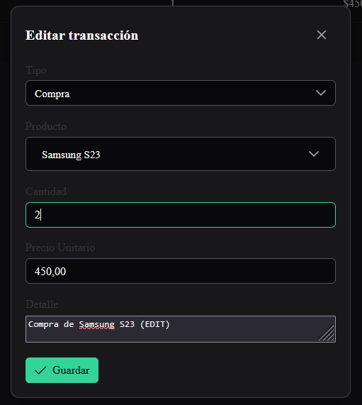

# RETO NETBY
## Sistema de Gestión de Productos y Transacciones

Este proyecto permite gestionar productos y transacciones de forma dinámica con filtros, paginación y validaciones, usando Angular en el frontend y .NET + SQL Server en el backend.

---

## Requisitos

Instalación previa de Docker

* [Docker y Docker Compose](https://docs.docker.com/get-docker/)

---

## Ejecución del Backend y Frontend

### Entorno de desarrollo

Para modo  desarrollo utilizar el archivo `docker-compose.dev.yml` Esto utiliza Dotnet-Watch y Live reload para cambios en tiempo real en el Frontend y Backend

docker-compose -f docker-compose.yml -f docker-compose.dev.yml up --build 

Servicios expuestos:

**Frontend (Angular dev)**: [http://localhost:4201](http://localhost:4201)
**Microservicio de Productos**: [http://localhost:9001](http://localhost:9001)
*Microservicio de Transacciones**: [http://localhost:9002](http://localhost:9002)
**Base de datos (SQL Server)**: `localhost:1433`

---

### Entorno de producción

Usar el archivo `docker-compose.yml` para modo producción

docker-compose up --build

---

### Entity Framework
Este desarrollo fue construido con microservicios en .NET Core, utilizando entity framework como ORM para la gestión de la base de datos, las migraciones se encuentran en el directorio /migraciones y está configurado para que se realice la carga iniciar por parte de los microservicios.
La base de datos es SQL Server contenerizada con Docker

---

### Documentación Swagger
La documentación se encuentra disponible en los siguientes enlaces:
- http://localhost:9001/swagger/index.html
- http://localhost:9002/swagger/index.html

---
## Validaciones
Se generan control de validaciones para que los usuarios visualicen mensajes de éxito, alerta o error usando Toast:
    - Cuando un usuario quiere vender más del stock existente del producto
    - Cuando existen campos vacíos
    - Los elementos controlan directamente el tipo de dato a ingresar
    - Se actualiza el stock del producto consumiendo el microservicio desde ms_transaccion, asegurando que siempre se mantenga coherencia entre los registros

---

## Evidencias

### Listado con paginación

* **Productos**

  

* **Transacciones**

  

---

### Crear registros

* **Nuevo Producto**

  

* **Nueva Transacción**

  

---

### Editar registros

* **Editar Producto**

  

* **Editar Transacción**

  

---

### Filtros dinámicos

* **Transacciones con filtro por tipo, producto y fechas**

  

---

### Consulta de Formulario (Extra)

* **Visualización de formulario con detalle o consulta extendida**

  

---

